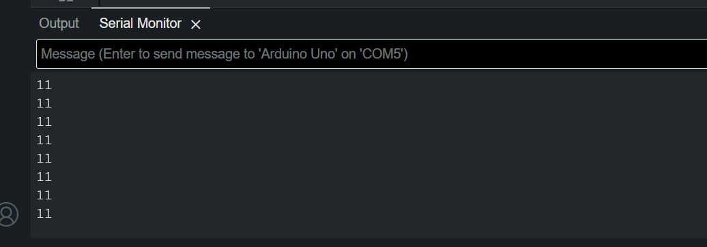
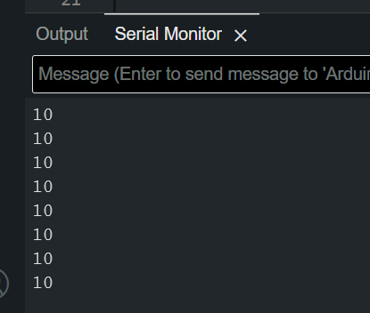
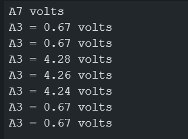
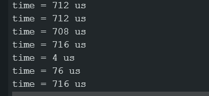
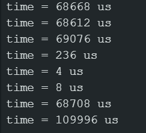
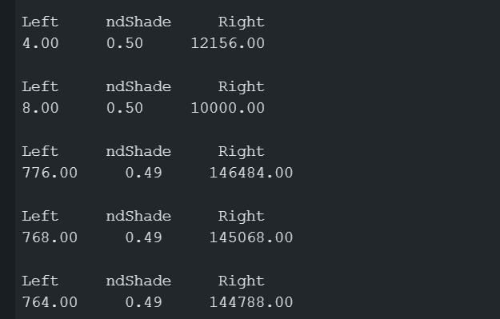
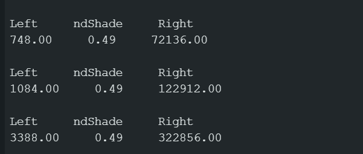
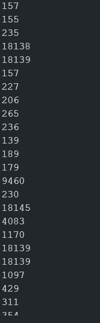

# Notes for Robotics work

## 9-11
- Got the setup working with the Arduino IDE software. couldn't get VSCode to work due to no Arduino IDE support.
```Arduino
void setup() {
  Serial.begin(9600);
  Serial.print("Hello?");
}

void loop() {
  // put your main code here, to run repeatedly:

}
```
## 9-13
### Activity 2
- got the loop code running.
```Arduino
void setup() {
    Serial.begin(9600);
    Serial.print("Hello?\n");
    Serial.print("whats a matter you?");
}

void loop() {
    Serial.print("Hello?\n");
    delay(1000);
}
```
Incorporated println() into program.
```Arduino
void loop() {
    Serial.println("Hello?\n");
    delay(1000);
}
```
### Activity 3
- Added the storage of variables and the printing of the stored variables.

```Arduino
    int a = 42;
    char c = 'm';
    float root2 = sqrt(2.0);

    Serial.println(a);
    Serial.println(c);
    Serial.println(root2);s
```
### Activity 4
- Worked on math operators in Arduino
```Arduino
  int a = 89;
  int b = 42;
  int c = a + b;

  Serial.println(a);
  Serial.println(b);
  Serial.println("a + b = ");
  Serial.println(c);
```

### Lab 1.2
- built up the arduino and shield together and assembled the led setup. 
Look at LED.ino in the LED folder to see the code used to light the lights. 
- Q1. the breadboard is a set of interconnected holes that allows you to place a wire or other component into 1 of 5 holes that are all interconnected to share power or pass power along without needing more wires
- Q2. Without ```pinMode(xx,OUTPUT)``` you get super faint output from the LED
- Q3. When you pass HIGH and LOW into the function it changes the output from sending higher power to sending lower power. HIGH has enough power to overcome the resistor and LOW does not.

### lab 2
- Got the BOE built the way it is supposed to be.
- the two servos are centered.
- When i mess with the values in the writeMicroseconds() function if its greater than the 1500 that i centered on it rotates counter-clockwise. if the value is lower it rotates clockwise.
```arduino
#include <Servo.h>
  Servo leftServo;
  Servo rightServo;
void setup() {
  leftServo.attach(11);
  rightServo.attach(10);
  leftServo.writeMicroseconds(1500);
  rightServo.writeMicroseconds(1500);
}

void loop() {}
```
# 10-02

## lab 3
- Got the speaker to make a police siren using the code in speaker.ino.
- retested the wheels with the provided code from the lab PDF and it didn't go in a straight line. It spun slightly to the left.
```arduino
#include<Servo.h>
Servo servoLeft;
Servo servoRight;
void setup () {
// Play a tone to show program is starting
tone(4, 3000, 1000);
delay(1000);
// Servos moved to 10 & 11 for more accurate results
// Try using 12 & 13 as well to see what happens
servoLeft.attach (11);
servoRight.attach (10);
// Full speed forward for 3 seconds
servoLeft.writeMicroseconds (1700);
servoRight.writeMicroseconds (1300);
delay(3000);
servoLeft.detach ();
servoRight.detach ();
}
void loop () {
}
```
- Servo issue has been discovered. I am using two different kinds of servos. I feel dumb. Servo has been swapped out so they now match and are centered on 1500.

# 10-12
- started the whisker lab.
- wrote the following code block. Watched serial ports to see the results. Look at the picture below the code block for an example of the results.
``` Arduino
void setup() {
    // Play a tone to show program is starting
    tone(4, 3000, 1000);
    delay(1000);

    pinMode(7, INPUT);
    pinMode(5, INPUT);
  
    Serial.begin(9600);
}
void loop() {

    byte whiskerLeft = digitalRead(5);
    byte whiskerRight = digitalRead(7);

    Serial.print(whiskerLeft);
    Serial.println(whiskerRight);

    delay(50);
}
```




- Modified the robot to include LEDs to demonstrate when the whiskers are triggered. 
- The left LED lights up when the left whisker is touched and the right lights up when the right is touched. 
- Finished off the code provided to have a fully whisker navigating bot with LEDs to indicate that which whisker caused the bot to restart.. See code block below for what was input to make it work. The lights are done with the pinMode() function and telling which pin to power. Then the digitalWrite() function was used in the if() else() statements to either light or not light the LEDs.
- the forward was provide the backward, and two turn functions were simple to write as they are just modifications of the forward code.
```Arduino
#include <Servo.h>
Servo servoLeft;
Servo servoRight;
void setup() {
    // Set the whisker pins to input
    pinMode(7, INPUT);
    pinMode(5, INPUT);

    // Adds LED option
    pinMode(8, OUTPUT);
    pinMode(2, OUTPUT);

    // Play a tone to show program is starting
    tone(4, 3000, 1000);
    delay(1000);

    // Attach the servos ( verify your pin number !)
    servoLeft.attach(11);
    servoRight.attach(10);
}
void loop() {
    // Save each whisker ’s value
    byte whiskerLeft = digitalRead(5);
    byte whiskerRight = digitalRead(7);

    // Navigate and turn
    if (whiskerLeft == 0 && whiskerRight == 0) {
        backward(1000);
        turnLeft(800);  // Turn about 120 degrees
        digitalWrite(2, HIGH);
        digitalWrite(8, HIGH);

    } else if (whiskerLeft == 0) {
        backward(1000);
        turnRight(400);  // Turn about 60 degrees
        digitalWrite(8, HIGH);

    } else if (whiskerRight == 0) {
        backward(1000);
        turnLeft(400);  // Turn about 60 degrees
        digitalWrite(2, HIGH);

    } else {
        forward(20);
        digitalWrite(8, LOW);
        digitalWrite(2, LOW);
    }
}

void forward(int time) {
    // These numbers may be different for you to go straight
    servoLeft.writeMicroseconds(1700);
    servoRight.writeMicroseconds(1300);
    delay(time);
}
void turnLeft(int time) {
    servoLeft.writeMicroseconds(1300);
    servoRight.writeMicroseconds(1300);
    delay(time);
}
void turnRight(int time) {
    servoLeft.writeMicroseconds(1700);
    servoRight.writeMicroseconds(1700);
    delay(time);
}
void backward(int time) {
    servoLeft.writeMicroseconds(1300);
    servoRight.writeMicroseconds(1700);
    delay(time);
}
```

# 10/13

- Changed the robot to have the single photo resistor setup. 
- Ran the below code to get voltage readouts in the picture below code block.
- the 0.67 volts was from ambient light. the 4.24+ volts were when I shined a flashlight at the phototransistor.
```Arduino
void setup() {
  // put your setup code here, to run once:
  Serial.begin(9600);
}

void loop() {
  // put your main code here, to run repeatedly:
  Serial.print("A3 = ");
  Serial.print(volts(A3));
  Serial.println(" volts");
  delay(1000);
}
float volts(int adPin){
  return float (analogRead(adPin)) *5.0 / 1024.0;
}
```


- Modified the code block from the above to allow the robot to move forward until it detects a light that makes it produce a voltage of 3.5 or higher. see code block below
```arduino
#include <Servo.h>
Servo servoLeft;
Servo servoRight;
void setup() {
    // Play a tone to show program is starting
    tone(4, 3000, 1000);
    delay(1000);

    // Servos moved to 10 & 11 for more accurate results
    // Try using 12 & 13 as well to see what happens
    servoLeft.attach(11);
    servoRight.attach(10);

    // Full speed forward for 3 seconds
    servoLeft.writeMicroseconds(1700);
    servoRight.writeMicroseconds(1300); 
}

void loop() {
  float stoppingVoltage = 3.5;
  if(volts(A3) > stoppingVoltage){
   servoLeft.detach();
    servoRight.detach();
    }  
}
float volts (int adPin){
  return float (analogRead(adPin)) *5 /1024.0;
}
```
- Modified the code to test the left circuit. the numbers in the 700s are ambient light. When it drops that is light being introduced to the left transistor.

- ambient light



- left intense light


- modified the code to test the right circuit. the super high numbers are ambient the lower numbers are with flashlight shining.



- Wrote a new file to test the two transistors together.
```Arduino
void setup() {
  tone(4,3000,1000);
  delay (1000);

  Serial.begin(9600);
}

void loop() {
  float timeDecayLeft = float(getDecayTime(8));
  float timeDecayRight = float(getDecayTime(6));

  float ndShade = timeDecayRight / (timeDecayRight + timeDecayLeft) - 0.5;

  Serial.println("Left     ndShade     Right");
  Serial.print(timeDecayLeft);
  Serial.print("     ");
  Serial.print(ndShade);
  Serial.print("     ");
  Serial.println(timeDecayRight);
  Serial.println("");

  delay(1000);
}
long getDecayTime(int pin){
  //charge the capacitor
  pinMode(pin, OUTPUT);
  digitalWrite(pin, HIGH);
  delay(1);

  //read from pin and wait for the voltage to drop.
  pinMode(pin,INPUT);
  digitalWrite(pin, LOW);
  long time = micros();
  while(digitalRead(pin));
  time = micros() - time;

  return time;
}
```
- The results for covering one transistor is the below pic

- Below pic is with both sensors covered.


- changed the code so the robot was seeking light from a flashlight. see code move_2_transistor.ino for details.

# 10/16
- built the PING robot. Started to figure out what parts of the provided code i can keep vs rewrite.

# 10/23
- Used the lab provided code to get the PING sensor setup. 


- got the robot to detect with the PING and send it to Serial port in cm.


- Modified the code so that the turret now connects and checks through different angles. It isn't the final code yet, but it gives me the idea to iterate through a few different angles in an array.
```arduino
#include <Servo.h>
Servo turretServo;
int turretAngle = 0;
void setup() {
    Serial.begin(9600);
    turretServo.attach(12);
    turretServo.write(turretAngle);
    
}
void loop() {
    long num = ping(13);  // PING is in pin 13
    turretServo.write(turretAngle);
    Serial.println(convert(num));
    delay(500);
    turretAngle +=45;
```
- I will be working to implement an array of positions for the PING sensor to look at and make decisions based on that data.

# 10/24
- got the turret to scan from 45 - 135 degrees in a loop.
- In file PINGtest I got the robot to drive forward and then stop when it detected an obstacle. When I remove the obstacle the robot starts to drive forward again.
```arduino
  if(convert(num) < 50){
      servoRight.detach();
      servoLeft.detach();
      Serial.println("too close to item.");
    }else{
      servoRight.attach(10);
      servoLeft.attach(11);
    }
```
- Modified PINGtest so the bot avoids objects by turning right instead of just stopping.
```arduino
if(convert(num) < 50){
      maneuver(200, -200); // turns the bot to the right.
      Serial.println("too close to item.");
    }
```
- I need to figure out how to determine which way to turn if an object is in the way, and how far ahead 

# 11-5 Update
- created initial walking code where legs will be paired front right and back left and vice versa.
- working on the turning function that will use the PING sensor to pick the most open route and guide the robot there. Then return to the standard walking.

- need to finish assembling the full body of the walker.
- need to shorten the legs from 7" long down 